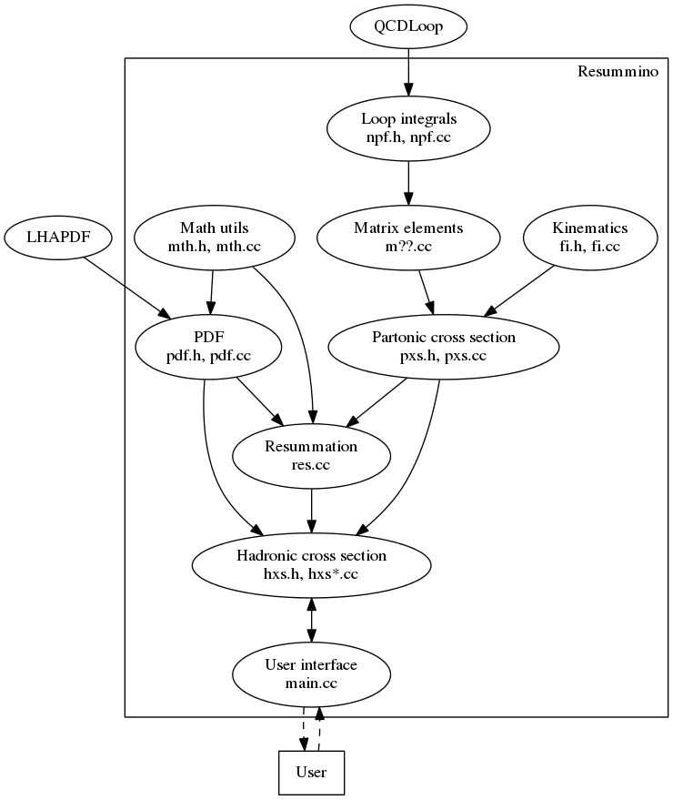

Resummino Developer's Guide Introduction {#mainpage}
========================================

## Resummino

Welcome the Resummino Developer's Guide.
<http://www.resummino.org/>

## Directory structure

File           | Description 
---------------|------------
include/       | Include files for external libraries (now GSL and SLHAea).
input/         | Input file examples. You can use them to test the software or modify them to fit your needs.
lib/           | QCDLoop library source code. Included in the CMake building chain for convenience.
src/           | Resummino source code.
CMakeLists.txt | CMake main file.
LICENCE        | Full text of the EUPLv1.1.
README.md      | README file with basic information on how to compile and run the software.

## Modules

The Resummino source code (which is inside the `src` folder) is organized in modules. The depency relationship between the modules and the files that define and implement them can be seen in the following graph. For more information about each module you can see the _Files_ section.

**Note:** The _Parameters_ module (defined in `prm.h` and implemented in `prm.cc`) and the _Utils_ module (defined and implemented in `utils.h`) are not shown in the dependency graph, since they are used basically by any other module of the code.

